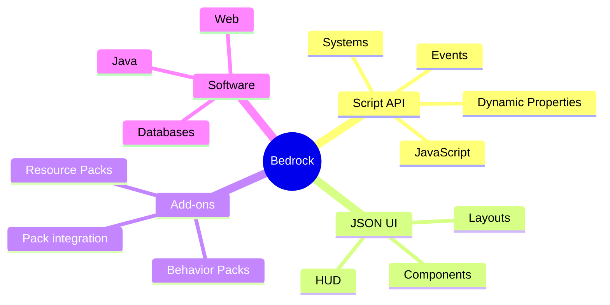
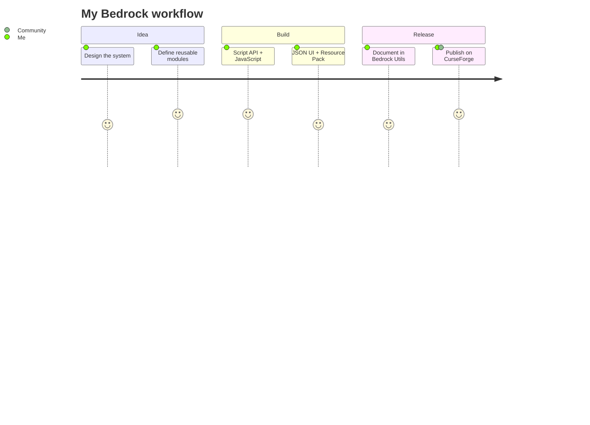
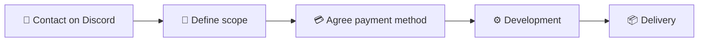

<div align="center">



<br>

<a href="https://github.com/IIBl4z3MasterII"></a>
<a href="https://bl4z3community.neocities.org/"></a>
<a href="https://www.curseforge.com/members/iibl4z3master/projects"></a>
<a href="https://www.youtube.com/@bl4z3master"></a>
<a href="https://discord.gg/kBNHNxXbMM"></a>

<br>


</div>


## 👨‍💻 About me

I build systems, tools and add-ons for **Minecraft Bedrock Edition**. My main field is the **Script API** with JavaScript: gameplay systems, reusable utilities, custom commands, UI and complete add-ons.

- 🪨 Bedrock developer: Script API · JSON UI · Behavior & Resource Packs
- 🧩 I build reusable modules that plug into different projects
- 🧠 Clean, modular code with real documentation
- 🎓 Systems engineering student, always learning new Bedrock APIs

> **I don't just make add-ons. I build reusable systems around the Bedrock ecosystem.**


## 🧰 Tech stack

<div align="center">


<br>


<br><br>


</div>


## 🧩 What I build

<table>
<tr>
<td width="50%" valign="top">

### ⚙️ Gameplay systems

- Custom commands
- Custom death messages
- Ban system
- Inventory systems
- Mob stacking
- World management
- Custom drops
- Data persistence

</td>
<td width="50%" valign="top">

### 🧰 Developer utilities

- Region utilities
- Cooldowns
- Raycasting
- Inventory helpers
- Particle helpers
- Armor set detection
- Enchantment utilities
- UI templates

</td>
</tr>
<tr>
<td width="50%" valign="top">

### 🎨 JSON UI

- Custom interfaces and layouts
- Reusable components
- HUD modifications
- UI pack analysis

</td>
<td width="50%" valign="top">

### 📦 Complete add-ons

- Behavior Packs + Resource Packs
- Custom systems and UI
- Textures and glyphs
- Script API integration

</td>
</tr>
</table>


## 🚀 Featured project: Bedrock Utils

Reusable **Minecraft Bedrock Script API** utilities, gameplay systems, complete add-ons and technical documentation.


<details>
<summary><b>📁 Repository structure</b></summary>

```text
bedrock-utils/
├── helpers/          # Reusable and atomic utilities
│   ├── chat-moderation/
│   ├── cooldown/
│   ├── coordinates/
│   ├── enchant-helper/
│   ├── inventory-helper/
│   ├── lore-durability/
│   ├── armor-set-detector/
│   ├── particle-helper/
│   ├── raycaster/
│   ├── region/
│   ├── rtp-helper/
│   ├── template-ui/
│   ├── timer/
│   └── index.js
├── systems/          # Complete gameplay systems
│   ├── ban-system/
│   ├── death-custom-msg/
│   ├── drops-in-inventory/
│   ├── mob-stacker/
│   ├── custom-commands/
│   ├── world-manager/
│   └── index.js
├── addons/           # Complete installable add-ons
│   └── shop-ui/
│       ├── bp/
│       └── rp/
├── assets/           # Static assets
│   └── glyphs/
└── docs/             # Bedrock technical documentation
    └── json-ui/
```

</details>

```bash
git clone https://github.com/IIBl4z3MasterII/bedrock-utils.git
```

```js
import { Region } from "./helpers/region/index.js";
import { CooldownManager } from "./helpers/cooldown/index.js";

// or through the aggregator
import { Region, CooldownManager, Timer } from "./helpers/index.js";
```

**[View Bedrock Utils on GitHub →](https://github.com/IIBl4z3MasterII/bedrock-utils)**


## 📚 Current focus






## 📊 GitHub

<div align="center">

<a href="https://github.com/IIBl4z3MasterII/bedrock-utils">
  
  
  
  
</a>

<br><br>

<kbd>
  
</kbd>

</div>


## 💳 Payment methods

<div align="center">



<br><br>


<br>


</div>

<br>

| Method | Where | Best for |
| :-- | :-- | :-- |
| 💳 **Visa · Mastercard · Amex** | 🌎 Worldwide | Card payments |
| 🅿️ **PayPal** | 🌎 Worldwide | International clients |
| 📱 **Yape** | 🇵🇪 Peru only | Instant local payments |
| 🌐 **Global66** | 🌎 International | Low-fee transfers between countries |

> Payment details are shared privately once we agree on the project. Contact me on **[Discord](https://discord.gg/kBNHNxXbMM)**.


## 💼 Open for commissions

Custom Minecraft Bedrock add-ons, Script API systems, JSON UI and full Behavior Pack + Resource Pack projects.



## 🌐 Find me

<div align="center">

<a href="https://bl4z3community.neocities.org/"></a>
<a href="https://bl4z3community.neocities.org/portafolio/"></a>
<a href="https://www.curseforge.com/members/iibl4z3master/projects"></a>
<a href="https://www.youtube.com/@bl4z3master"></a>
<a href="https://discord.gg/kBNHNxXbMM"></a>

<br><br>

### 🪨 Building systems for Bedrock, one module at a time.


<sub>Personal developer profile · Minecraft Bedrock community projects · Not affiliated with Mojang or Microsoft.</sub>

</div>
