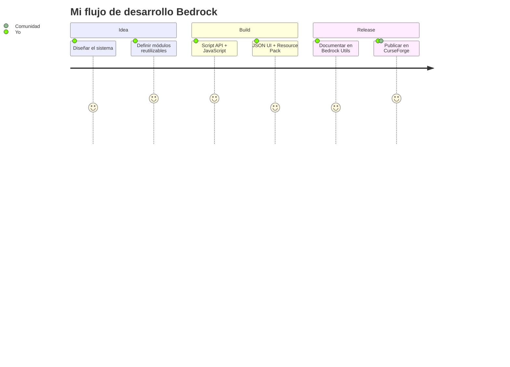

<div align="center">

# 🪨 IIBl4z3MasterII

### Minecraft Bedrock Developer · JavaScript · Script API · JSON UI

<p>
  
</p>

<p>
  <a href="https://github.com/IIBl4z3MasterII">
    
  </a>
  <a href="https://bl4z3community.neocities.org/">
    
  </a>
  <a href="https://www.curseforge.com/members/iibl4z3master/projects">
    
  </a>
  <a href="https://discord.gg/kBNHNxXbMM">
    
  </a>
</p>

<p>
  
  
</p>

</div>

---

# 👨‍💻 About Me

I'm **IIBl4z3MasterII**, a developer focused on creating systems, tools and add-ons for **Minecraft Bedrock Edition**.

My main area of development is the **Minecraft Bedrock Script API**, where I work with JavaScript to build gameplay systems, reusable utilities, custom commands, UI systems and complete add-ons.

- 🪨 **Minecraft Bedrock Developer**
- ⚙️ **Script API Developer**
- 🎨 **JSON UI Developer**
- 🧩 Building reusable systems and utilities
- 📦 Creating complete Behavior Pack + Resource Pack add-ons
- 🧠 Interested in clean, modular and reusable code
- 🔧 Developing tools that can be integrated into different projects
- 📚 Continuously studying software development and new Bedrock APIs

> **I don't just make add-ons — I build reusable systems around the Bedrock ecosystem.**

---

# 🧰 Tech Stack

## 🎮 Minecraft Bedrock

<p align="left">
  
  
  
</p>

## 💻 Languages

<p align="left">
  
</p>

## ⚙️ Minecraft APIs

<p align="left">
  
  
</p>

## 🗄️ Databases & Data

<p align="left">
  
  
</p>

## 🔧 Development Tools

<p align="left">
  
</p>

---

# 🧩 What I Build

<table>
<tr>
<td width="50%" valign="top">

### ⚙️ Gameplay Systems

Systems designed to handle complete gameplay functionality.

- 🔨 Custom commands
- 💀 Custom death systems
- 🚫 Ban systems
- 📦 Inventory systems
- 🧟 Mob stacking
- 🌎 World management
- 🎁 Custom drops
- 💾 Data persistence

</td>

<td width="50%" valign="top">

### 🧰 Developer Utilities

Reusable modules designed to be integrated into other projects.

- 📍 Region utilities
- ⏱️ Cooldowns
- 🎯 Raycasting
- 📦 Inventory helpers
- ✨ Particle helpers
- 🛡️ Armor detection
- 🧪 Enchantment utilities
- 🖥️ UI templates

</td>
</tr>

<tr>
<td width="50%" valign="top">

### 🎨 JSON UI

Working with Minecraft Bedrock's UI system.

- Custom interfaces
- UI layouts
- UI components
- HUD modifications
- JSON UI patterns
- UI pack analysis
- Reusable UI fragments

</td>

<td width="50%" valign="top">

### 📦 Complete Add-ons

Complete projects combining Behavior Packs and Resource Packs.

- Behavior Packs
- Resource Packs
- Custom systems
- Custom UI
- Textures & glyphs
- Script API integration

</td>
</tr>
</table>

---

# 🚀 Featured Project

## 🪨 Bedrock Utils

A collection of reusable **Minecraft Bedrock Script API** utilities, gameplay systems, complete add-ons and technical documentation.


### Repository structure

```text
bedrock-utils/
│
├── helpers/          # Reusable and atomic utilities
│   ├── chat-moderation/
│   ├── cooldown/
│   ├── coordinates/
│   ├── enchant-helper/
│   ├── inventory-helper/
│   ├── lore-durability/
│   ├── armor-set-detector/
│   ├── particle-helper/
│   ├── raycaster/
│   ├── region/
│   ├── rtp-helper/
│   ├── template-ui/
│   ├── timer/
│   └── index.js
│
├── systems/          # Complete gameplay systems
│   ├── ban-system/
│   ├── death-custom-msg/
│   ├── drops-in-inventory/
│   ├── mob-stacker/
│   ├── custom-commands/
│   ├── world-manager/
│   └── index.js
│
├── addons/           # Complete installable add-ons
│   └── shop-ui/
│       ├── bp/
│       └── rp/
│
├── assets/           # Static assets
│   └── glyphs/
│
└── docs/             # Bedrock technical documentation
    └── json-ui/
```

### Installation

```bash
git clone https://github.com/IIBl4z3MasterII/bedrock-utils.git
```

Example:

```js
import { Region } from "./helpers/region/index.js";
import { CooldownManager } from "./helpers/cooldown/index.js";
```

Or import multiple utilities through the aggregator:

```js
import {
    Region,
    CooldownManager,
    Timer
} from "./helpers/index.js";
```

🔗 **[View Bedrock Utils →](https://github.com/IIBl4z3MasterII/bedrock-utils)**

---

# 📚 Current Focus

```text
Minecraft Bedrock
      │
      ├── Script API
      │     ├── JavaScript
      │     ├── Events
      │     ├── Systems
      │     └── Dynamic Properties
      │
      ├── JSON UI
      │     ├── Layouts
      │     ├── Components
      │     ├── HUD
      │     └── Advanced UI systems
      │
      ├── Add-on Development
      │     ├── Behavior Packs
      │     ├── Resource Packs
      │     ├── Custom Content
      │     └── Pack Integration
      │
      └── Software Development
            ├── Java
            ├── JavaScript
            ├── Databases
            └── Web Development
```

---

# 📊 GitHub

<div align="center">

<a href="https://github.com/IIBl4z3MasterII/bedrock-utils">
  
  
  
  
</a>

<br><br>

<kbd>
  
</kbd>

</div>

<br>



---

# 🌐 Find Me

<div align="center">

<a href="https://bl4z3community.neocities.org/">
  
</a>

<a href="https://bl4z3community.neocities.org/portafolio/">
  
</a>

<a href="https://www.curseforge.com/members/iibl4z3master/projects">
  
</a>

<a href="https://www.youtube.com/@bl4z3master">
  
</a>

<a href="https://discord.gg/kBNHNxXbMM">
  
</a>

</div>

---

# 💼 Open for Commissions

I also develop **custom Minecraft Bedrock projects** and systems.

```text
Custom Add-ons
      ↓
Script API Systems
      ↓
JSON UI
      ↓
Behavior Packs + Resource Packs
      ↓
Custom Integrations
```

For commissions, collaborations or technical projects, contact me through **Discord**.

---

<div align="center">

### 🪨 Building systems for Bedrock, one module at a time.

<br>


</div>

<sub>
Personal developer profile • Minecraft Bedrock community projects • Not affiliated with Mojang or Microsoft.
</sub>
